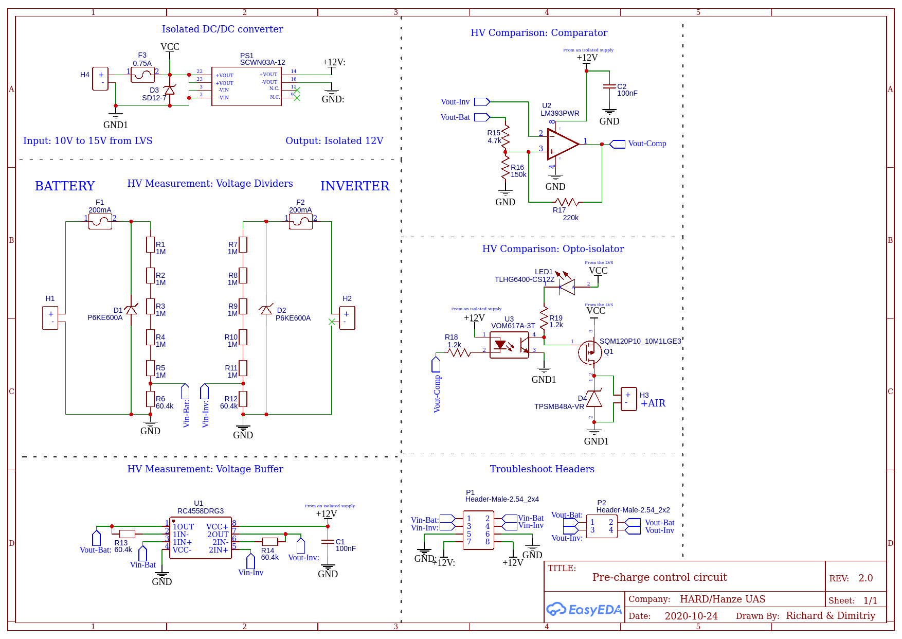
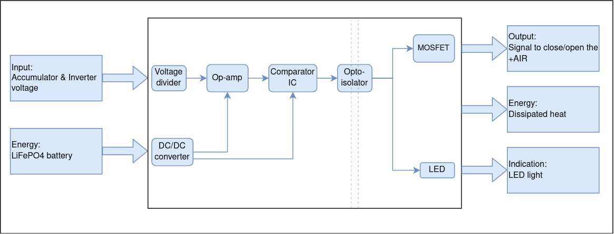
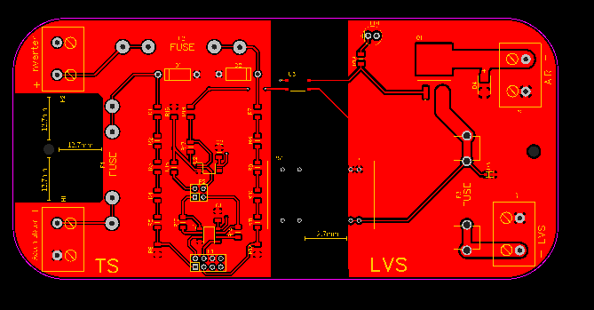

# 600V Pre-charge Circuit

One of the challenges that arise in tractive systems
of electric cars is establishing a reliable connection between
the accumulator and inverter. The presented pre-charge control
circuit is a potential solution that can be used to operate a DC
contractor and prevent the flow of high inrush current into the
inverter. The circuit has been simulated in LTspice and tested
in real life across the temperature range of +10 °C to +65 °C.
Pre-charging is stopped once the inverter voltage exceeds 98%
of the voltage level of the accumulator and resumed when it is
below 95%. Regardless, this design is incomplete. There are several design flaws that have been discovered and therefore require further development.

2-layer PCB designed in EasyEDA. Gerber and assembly files are in the relevant repo folders.

  
  
  

  
